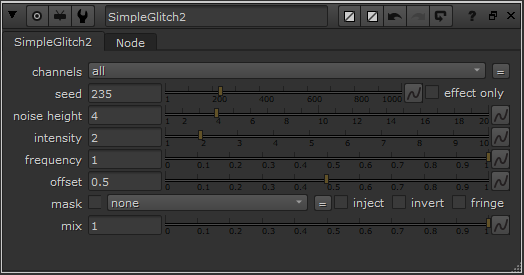

# SimpleGlitch2

## Description
This node applies a horizontal glitch effect to the image lines.

---

## Examples

---

## Options

### Knob Explanations
1. **Seed:**
   - Random seed for the glitch pattern.

2. **Effect Only:**
   - Outputs only the glitch effect.

3. **Noise Height:**
   - Height in lines for each glitch block.

4. **Intensity:**
   - Intensity of the horizontal displacement.

5. **Frequency:**
   - Frequency at which glitch lines occur.

6. **Offset:**
   - General image Offset.

---

## Compatibility

Check the supported Nuke versions [`here`](./COMPATIBILITY.md)

---

## Installation
📥 Follow these steps to install the plugin:

1. Download the latest version from the [Releases](https://github.com/youruser/ProjectName/releases) section.
2. 📦 Extract the contents of the downloaded `.zip` file.
3. 📂 Copy the extracted file to your system's `.nuke` directory.

   **Example of `.nuke` Directory Location:**
   - On Windows: `C:\Users\YourUser\.nuke`
   - On Linux: `/home/youruser/.nuke`

4. ✅ Open Nuke and verify that the plugin is available in the toolbar or node menu.

---

🚀 You're all set! Start using **SimpleGlitch2** in your compositions now.
